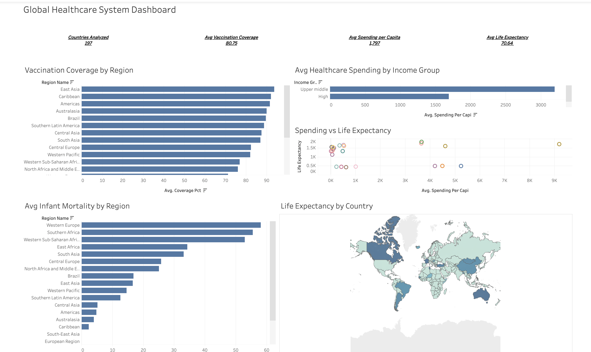
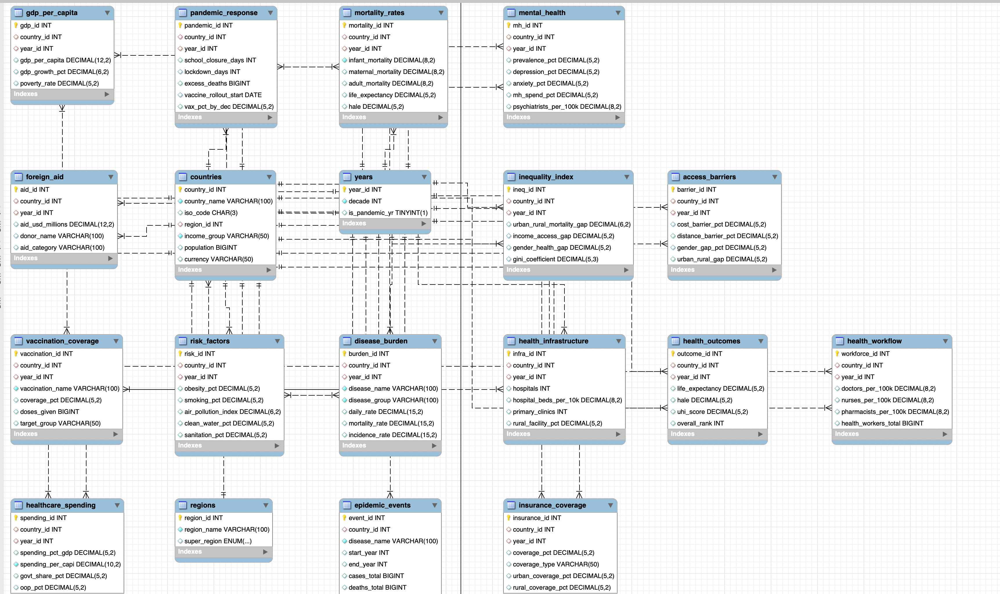
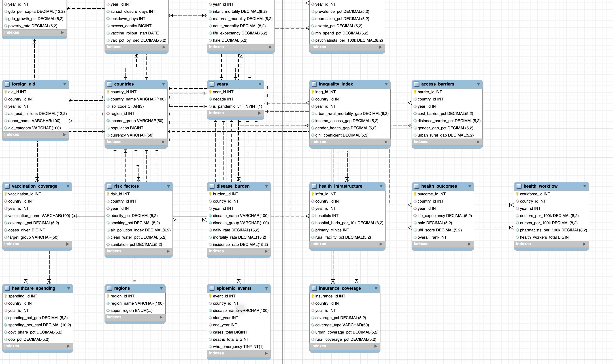

# 🌍 Global Healthcare System Database



A 19-table relational healthcare analytics database built in MySQL to analyze global healthcare KPIs across 190+ countries using real-world inspired data from WHO, 
World Bank, and IHME sources.

Built to analyze how healthcare systems performed across regions during 
critical global periods — and to demonstrate the ability to work with 
large, interconnected datasets at a professional level.

---

## ⚙️ Tech Stack

- MySQL Workbench
- SQL
- Tableau Public
- CSV Data Integration
- Relational Database Modeling

---

## 📊 Dashboard

👉 [View Live Dashboard on Tableau Public](https://public.tableau.com/app/profile/muhammad.ammar.saleem/viz/GlobalHealthcareSystemDashboard/GlobalHealthcareSystemDashboard) 

---

## 🗄️ Database Overview

| Detail | Info |
|---|---|
| **Tables** | 19 |
| **Countries** | 190+ |
| **Data Sources** | WHO, World Bank, IHME, OWID |
| **Tool** | MySQL Workbench |
| **Visualization** | Tableau Public |

---

## 🧩 Database Modules

The database includes tables related to:

- Country demographics
- Healthcare spending
- Mortality statistics
- Vaccination coverage
- Disease burden
- Risk factors
- Pandemic response
- Insurance coverage
- Health infrastructure

---

## 🚀 Skills Demonstrated

- Data Modeling
- Relational Database Design
- SQL Query Optimization
- KPI Analysis
- Business Intelligence
- Tableau Dashboarding
- Healthcare Data Analytics

---

## 🗺️ Entity Relationship Diagram




---

## ❓ Business Questions Answered

| # | Business Question | Key Finding |
|---|---|---|
| 1 | Which countries have the highest life expectancy in 2019? | Jamaica (80.84), Turkey (80.13), Tunisia (79.92) |
| 2 | How does healthcare spending vary across countries and income groups? | Upper middle income spends the most (~3,200 avg), Low income spends the least |
| 3 | Which regions have the best vaccination coverage? | East Asia leads at ~93%, Caribbean and Americas close behind |
| 4 | Which countries are high disease burden but low spending? | Senegal topped the list with mortality rate of 285 |
| 5 | How does healthcare spending correlate with life expectancy? | Higher spending generally correlates with longer life — visible in scatter plot |
| 6 | What is the risk profile by obesity, smoking, air pollution? | China classified High Risk, most countries Moderate Risk |
| 7 | Which countries have the strongest healthcare scorecard? | Australia, Canada, France, Georgia — High spending + Strong life expectancy + Good vaccination |

---

## 🔍 SQL Concepts Used

- **Multi-table JOINs** — up to 4 tables in a single query
- **CASE statements** — KPI classification and labeling
- **CTEs** — Common Table Expressions for clean, readable logic
- **Chained CTEs** — multiple CTEs compared in one final output
- **CASE inside CTEs** — classify then filter by label
- **Aggregate functions** — AVG, MAX, COUNT with GROUP BY
- **Subquery filtering** — WHERE on computed columns

---

## 📝 Queries

### Q1 — Life Expectancy by Country (2019)
```sql
Select c.country_name, r.region_name, c.income_group, mr.life_expectancy
from countries as c
join regions as r on r.region_id = c.region_id
join mortality_rates as mr on c.country_id = mr.country_id
join years as y on y.year_id = mr.year_id
where y.year_id = 2019
order by mr.life_expectancy desc;
```

---

### Q2 — Healthcare Spending Classification (2020)
```sql
Select c.country_name, hs.spending_per_capi,
    CASE
        WHEN hs.spending_per_capi > 1500 THEN 'High Spend'
        WHEN hs.spending_per_capi BETWEEN 500 AND 1500 THEN 'Medium Spend'
        ELSE 'Low Spend'
    END as spending_situation
from countries as c 
join healthcare_spending as hs on hs.country_id = c.country_id
join years as y on y.year_id = hs.year_id
where y.year_id = 2020
ORDER BY hs.spending_per_capi DESC;
```

---

### Q3 — Infant Mortality System Classification (2019)
```sql
SELECT mr.infant_mortality, r.region_name, c.income_group,
    CASE
        WHEN mr.infant_mortality > 50 THEN 'Critical'
        WHEN mr.infant_mortality BETWEEN 20 AND 50 THEN 'Developing'
        WHEN mr.infant_mortality BETWEEN 5 AND 20 THEN 'Adequate'
        ELSE 'Strong'
    END as infant_mortality_rate
from countries as c
join regions as r on r.region_id = c.region_id
join mortality_rates as mr on c.country_id = mr.country_id
join years as y on y.year_id = mr.year_id
where y.year_id = 2019
order by mr.infant_mortality desc;
```

---

### Q4 — Average Life Expectancy per Region (CTE)
```sql
WITH avg_life_expectancy AS (
    SELECT avg(mr.life_expectancy) as avg_life, r.region_name
    from countries as c
    join regions as r on r.region_id = c.region_id
    join mortality_rates as mr on c.country_id = mr.country_id
    join years as y on y.year_id = mr.year_id
    where y.year_id = 2019
    group by r.region_name
)
SELECT region_name, ROUND(avg_life, 2) AS avg_life_expectancy 
from avg_life_expectancy
ORDER BY avg_life DESC;
```

---

### Q5 — Regions Above Global Avg Spending (2 CTEs)
```sql
WITH avg_spending_per_region AS(
   SELECT avg(hs.spending_per_capi) as avg_per_region, r.region_name
   FROM regions as r
   JOIN countries as c on c.region_id = r.region_id
   JOIN healthcare_spending as hs on hs.country_id = c.country_id
   JOIN years as y on y.year_id = hs.year_id
   WHERE y.year_id = 2020
   group by r.region_name
),
global_avg as (
   SELECT avg(hs.spending_per_capi) as global_average
   FROM regions as r
   JOIN countries as c on c.region_id = r.region_id
   JOIN healthcare_spending as hs on hs.country_id = c.country_id
   JOIN years as y on y.year_id = hs.year_id
   WHERE y.year_id = 2020
)
SELECT region_name, avg_per_region
FROM avg_spending_per_region, global_avg
WHERE avg_per_region > global_average;
```

---

### Q6 — Vaccination Coverage Classification (CASE in CTE)
```sql
WITH vaccination_by_countries as (
    SELECT c.country_name, vc.vaccination_name, vc.coverage_pct,
    CASE
        WHEN vc.coverage_pct > 90 THEN 'Excellent'
        WHEN vc.coverage_pct BETWEEN 75 and 90 THEN 'Good'
        WHEN vc.coverage_pct BETWEEN 50 AND 75 THEN 'Fair'
        ELSE 'Poor'
    END as vaccine_situation
    from countries as c 
    join vaccination_coverage as vc on c.country_id = vc.country_id
    join years as y on y.year_id = vc.year_id
    where y.year_id = 2020
)
SELECT country_name, vaccination_name, coverage_pct, vaccine_situation
from vaccination_by_countries
where vaccine_situation IN ('Excellent', 'Good')
order by coverage_pct desc;
```

---

### Q7 — Country Risk Profile (2019)
```sql
WITH country_risk_profile AS (
    SELECT c.country_name, r.region_name, rf.obesity_pct, 
           rf.smoking_pct, rf.air_pollution_index,
    CASE
        WHEN obesity_pct > 35 AND smoking_pct > 20 THEN 'High Risk'
        WHEN obesity_pct > 25 OR smoking_pct > 15 THEN 'Moderate Risk'
        ELSE 'Low Risk'
    END as label_risk_factor
    from countries as c 
    join regions as r on r.region_id = c.region_id
    join risk_factors as rf on c.country_id = rf.country_id
    join years as y on y.year_id = rf.year_id
    where y.year_id = 2019
)
SELECT country_name, region_name, label_risk_factor
from country_risk_profile
order by label_risk_factor asc;
```

---

### Q8 — Most Underfunded Healthcare Systems (2020)
```sql
WITH average_mortality_rate as (
    SELECT c.country_name, db.disease_name, db.mortality_rate,
    CASE
        WHEN db.mortality_rate > 50 THEN 'High Burden'
        ELSE 'Low Burden'
    END as mortality_situation
    from countries as c 
    join disease_burden as db on db.country_id = c.country_id
    join years as y on y.year_id = db.year_id
    where y.year_id = 2020
),
average_spending_per_capita as (
    SELECT c.country_name, hs.spending_per_capi,
    CASE 
        WHEN spending_per_capi < 2500 THEN 'Low Spending'
        ELSE 'High Spending'
    END as spendings
    from countries as c 
    join healthcare_spending as hs on hs.country_id = c.country_id
    join years as y on y.year_id = hs.year_id
    where y.year_id = 2020
)
SELECT average_mortality_rate.country_name, disease_name, mortality_rate
FROM average_mortality_rate
JOIN average_spending_per_capita 
ON average_mortality_rate.country_name = average_spending_per_capita.country_name
WHERE average_mortality_rate.mortality_situation = 'High Burden'
AND average_spending_per_capita.spendings = 'Low Spending'
order by mortality_rate desc 
limit 10;
```

---

### Q9 — Healthcare System Scorecard (4 CTEs)
```sql
WITH spending_label AS (
    SELECT 
        c.country_id, c.country_name, r.region_name,
        MAX(hs.spending_per_capi) as spending_per_capi,
        CASE
            WHEN MAX(hs.spending_per_capi) > 5000 THEN 'High'
            WHEN MAX(hs.spending_per_capi) BETWEEN 2000 AND 5000 THEN 'Medium'
            ELSE 'Low'
        END AS spending_status
    FROM countries c
    JOIN regions r ON r.region_id = c.region_id
    JOIN healthcare_spending hs ON hs.country_id = c.country_id
    JOIN years y ON y.year_id = hs.year_id
    WHERE y.year_id = 2023
    GROUP BY c.country_id, c.country_name, r.region_name
),
life_expectancy_label AS (
    SELECT c.country_id,
        MAX(mr.life_expectancy) as life_expectancy,
        CASE
            WHEN MAX(mr.life_expectancy) >= 78 THEN 'Strong'
            WHEN MAX(mr.life_expectancy) BETWEEN 65 AND 77 THEN 'Adequate'
            ELSE 'Weak'
        END AS life_expectancy_status
    FROM countries as c
    JOIN mortality_rates as mr ON mr.country_id = c.country_id
    JOIN years as y ON y.year_id = mr.year_id
    WHERE y.year_id = 2023
    GROUP BY c.country_id
),
vaccination_label AS (
    SELECT c.country_id,
        MAX(vc.coverage_pct) as coverage_pct,
        CASE
            WHEN MAX(vc.coverage_pct) > 90 THEN 'Excellent'
            WHEN MAX(vc.coverage_pct) BETWEEN 75 AND 90 THEN 'Good'
            WHEN MAX(vc.coverage_pct) BETWEEN 50 AND 74 THEN 'Fair'
            ELSE 'Poor'
        END AS vaccination_status
    FROM countries as c
    JOIN vaccination_coverage as vc ON vc.country_id = c.country_id
    JOIN years as y ON y.year_id = vc.year_id
    WHERE y.year_id = 2023
    GROUP BY c.country_id
),
infant_mortality_label AS (
    SELECT c.country_id,
        max(mr.infant_mortality) as infant_mortality,
        CASE
            WHEN max(mr.infant_mortality) > 50 THEN 'Critical'
            WHEN max(mr.infant_mortality) BETWEEN 20 AND 50 THEN 'Developing'
            WHEN max(mr.infant_mortality) BETWEEN 5 AND 19 THEN 'Adequate'
            ELSE 'Strong'
        END AS infant_mortality_status
    FROM countries as c
    JOIN mortality_rates as mr ON mr.country_id = c.country_id
    JOIN years as y ON y.year_id = mr.year_id
    WHERE y.year_id = 2023
    GROUP BY c.country_id
)
SELECT
    sl.country_name, sl.region_name,
    sl.spending_status,
    lel.life_expectancy_status,
    vl.vaccination_status,
    iml.infant_mortality_status
FROM spending_label sl
JOIN life_expectancy_label as lel ON sl.country_id = lel.country_id
JOIN vaccination_label as vl ON sl.country_id = vl.country_id
JOIN infant_mortality_label as iml ON sl.country_id = iml.country_id
ORDER BY sl.country_name;
```

---

## 💡 What I Learned

- **CTEs are not scary** — they're named subqueries that make complex logic clean and readable
- **Learned CTEs by applying them** directly to real business questions, not from tutorials
- **Business question first** — starting with the question produces cleaner, more meaningful queries
- **Handled a 19-table database** with 6,400+ lines of SQL — the largest I've built so far
- **Realized mid-session** that I was writing queries bigger than I thought I could — 4-CTE scorecards, chained comparisons, risk profiling with custom logic
- **Formatting and structure** matter as much as correctness in professional SQL

---

## ▶️ How to Run

1. Open MySQL Workbench
2. Import `Global_Healthcare_System.sql`
3. Execute the script to create all tables and insert data
4. Connect Tableau to exported CSV files
5. Open Tableau dashboard

---

## 📁 Files

| File | Description |
|---|---|
| `Global_Healthcare_System.sql` | Full database — tables, data, and all 9 queries |
| `*.csv` | Individual table exports for Tableau connection |
| `ER_1.png` | Entity Relationship Diagram part 1 |
| `ER_2.png` | Entity Relationship Diagram part 2 |
| `Dashboard.png` | Tableau dashboard screenshot |
